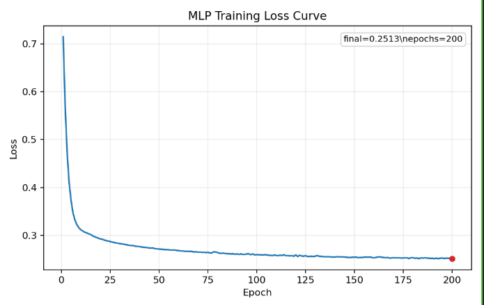

# Snorkeling Markdown 图片路径验证

> 用于验证 Markdown Preview Block 对不同图片路径的解析。原始图片来自 Obsidian 笔记：`01-机器学习随学随记.md:99`。

## A. 与原始 Obsidian 结构一致的相对路径（重点验证）

```markdown

```


## B. 同一图片，扁平相对路径

```markdown

```


## C. 同一图片，带 alt 文本


## D. 原始 Obsidian 文件的绝对 Windows 路径

```markdown

```


## E. 另一张图片作为对照


