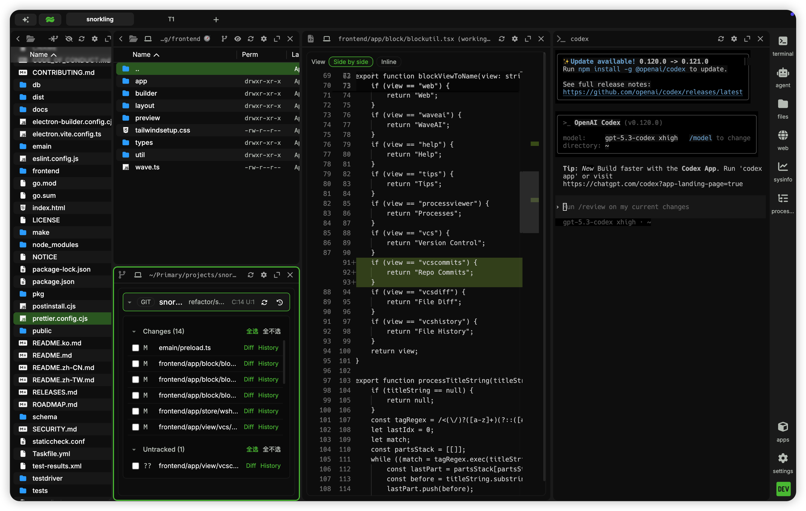

  <a href="https://github.com/Nita121388/snorkeling">
	<picture>
		<source media="(prefers-color-scheme: dark)" srcset="./assets/snorkeling-icon.svg">
		<source media="(prefers-color-scheme: light)" srcset="./assets/snorkeling-icon.svg">
		
	</picture>
  </a>
   

# Snorkeling (Wave-based)

[English](README.md) | [简体中文](README.zh-CN.md) | [繁體中文](README.zh-TW.md) | [한국어](README.ko.md)

## Snorkeling Custom Highlights

- This repo is based on upstream `wavetermdev/waveterm` and maintained on branch `refactor/snorkeling`.
- Product goal: stay in Terminal for core workflows (open, edit, compare, commit, and launch Agent) whenever possible.
- Agent workflow enhancements:
  - Dedicated `Agent` entry in the right sidebar.
  - Agent launch now considers both terminal context and focused Files path:
    - If SSH/path context matches, it auto-launches directly.
    - If context differs, it opens a selector so users can choose.
  - Agent profile support (`agent:defaultprofile`, `agent:profiles`) plus session auto-resume behavior.
- AI Sessions workflow:
  - Dedicated `Sessions` entry in the right sidebar for browsing local Codex and Claude Code conversation history.
  - Supports search, source filters, newest/oldest sorting, outline navigation, notes, marks, delete confirmation, and resume actions.
  - Current scope is local session files only; remote host session browsing is a planned extension.
- Files workflow enhancements:
  - Directional open target support (`🧭`, `←`, `→`, `↑`, `↓`) for opening files/folders into target blocks.
  - `🪧 Copy Context` in editor and file diff views (absolute path + line + snippet).
  - `Open VS Code Here` in Files context menu (local connection).
- Version control workflow enhancements:
  - Dedicated `VCS`, `File History`, and `File Diff` blocks.
  - Visual diff viewer (side-by-side / inline), with direct diff open from history.
  - Repository utilities: copy repository path/link and open remote repository.
- Window/layout enhancements:
  - `Move Tab to New Window` support.
- Branding updates:
  - Snorkeling icon pipeline uses Twemoji snorkel (`🤿`, `1f93f`) with SVG source at [`assets/snorkeling-icon.svg`](./assets/snorkeling-icon.svg).

Wave is an open-source, AI-integrated terminal for macOS, Linux, and Windows. It works with any AI model. Bring your own API keys for OpenAI, Claude, or Gemini, or run local models via Ollama and LM Studio. No accounts required.

Wave also supports durable SSH sessions that survive network interruptions and restarts, with automatic reconnection. Edit remote files with a built-in graphical editor and preview files inline without leaving the terminal.

### UI Preview

Snorkeling custom screenshot:

Original Wave screenshot:

## Key Features

- Wave AI - Context-aware terminal assistant that reads your terminal output, analyzes widgets, and performs file operations
- Durable SSH Sessions - Remote terminal sessions survive connection interruptions, network changes, and Wave restarts with automatic reconnection
- Flexible drag & drop interface to organize terminal blocks, editors, web browsers, and AI assistants
- Built-in editor for editing remote files with syntax highlighting and modern editor features
- Rich file preview system for remote files (markdown, images, video, PDFs, CSVs, directories)
- Quick full-screen toggle for any block - expand terminals, editors, and previews for better visibility, then instantly return to multi-block view
- AI chat widget with support for multiple models (OpenAI, Claude, Azure, Perplexity, Ollama)
- Command Blocks for isolating and monitoring individual commands
- One-click remote connections with full terminal and file system access
- Secure secret storage using native system backends - store API keys and credentials locally, access them across SSH sessions
- Rich customization including tab themes, terminal styles, and background images
- Powerful `wsh` command system for managing your workspace from the CLI and sharing data between terminal sessions
- Connected file management with `wsh file` - seamlessly copy and sync files between local and remote SSH hosts
- Local AI session browser for Codex and Claude Code conversations

## Wave AI

Wave AI is your context-aware terminal assistant with access to your workspace:

- **Terminal Context**: Reads terminal output and scrollback for debugging and analysis
- **File Operations**: Read, write, and edit files with automatic backups and user approval
- **CLI Integration**: Use `wsh ai` to pipe output or attach files directly from the command line
- **BYOK Support**: Bring your own API keys for OpenAI, Claude, Gemini, Azure, and other providers
- **Local Models**: Run local models with Ollama, LM Studio, and other OpenAI-compatible providers
- **Free Beta**: Included AI credits while we refine the experience
- **Coming Soon**: Command execution (with approval)

Learn more in our [Wave AI documentation](https://docs.waveterm.dev/waveai) and [Wave AI Modes documentation](https://docs.waveterm.dev/waveai-modes).

## Installation

Wave Terminal works on macOS, Linux, and Windows.

Platform-specific installation instructions can be found [here](https://docs.waveterm.dev/gettingstarted).

You can also install Wave Terminal directly from: [www.waveterm.dev/download](https://www.waveterm.dev/download).

### Minimum requirements

Wave Terminal runs on the following platforms:

- macOS 11 or later (arm64, x64)
- Windows 10 1809 or later (x64)
- Linux based on glibc-2.28 or later (Debian 10, RHEL 8, Ubuntu 20.04, etc.) (arm64, x64)

The WSH helper runs on the following platforms:

- macOS 11 or later (arm64, x64)
- Windows 10 or later (x64)
- Linux Kernel 2.6.32 or later (x64), Linux Kernel 3.1 or later (arm64)

## Roadmap

Wave is constantly improving! Our roadmap will be continuously updated with our goals for each release. You can find it [here](./ROADMAP.md).

Want to provide input to our future releases? Connect with us on [Discord](https://discord.gg/XfvZ334gwU) or open a [Feature Request](https://github.com/wavetermdev/waveterm/issues/new/choose)!

## Snorkeling Project Docs

- Project Charter (CN): [docs/project/snorkeling-project-charter.md](./docs/project/snorkeling-project-charter.md)
- Execution Plan (CN): [docs/project/snorkeling-execution-plan.md](./docs/project/snorkeling-execution-plan.md)
- Agent Config (CN): [docs/project/agent-config.md](./docs/project/agent-config.md)
- AI Sessions (CN): [docs/project/ai-sessions.md](./docs/project/ai-sessions.md)
- CI/CD & Release (CN): [docs/project/ci-cd-release.md](./docs/project/ci-cd-release.md)
- Upstream Sync Playbook (CN): [docs/project/upstream-sync-playbook.md](./docs/project/upstream-sync-playbook.md)

## Links

- Homepage &mdash; https://www.waveterm.dev
- Download Page &mdash; https://www.waveterm.dev/download
- Documentation &mdash; https://docs.waveterm.dev
- X &mdash; https://x.com/wavetermdev
- Discord Community &mdash; https://discord.gg/XfvZ334gwU

## Building from Source

See [Building Wave Terminal](BUILD.md).

## Contributing

Wave uses GitHub Issues for issue tracking.

Find more information in our [Contributions Guide](CONTRIBUTING.md), which includes:

- [Ways to contribute](CONTRIBUTING.md#contributing-to-wave-terminal)
- [Contribution guidelines](CONTRIBUTING.md#before-you-start)

### Sponsoring Wave ❤️

If Wave Terminal is useful to you or your company, consider sponsoring development.

Sponsorship helps support the time spent building and maintaining the project.

- https://github.com/sponsors/wavetermdev

## License

Wave Terminal is licensed under the Apache-2.0 License. For more information on our dependencies, see [here](./ACKNOWLEDGEMENTS.md).
