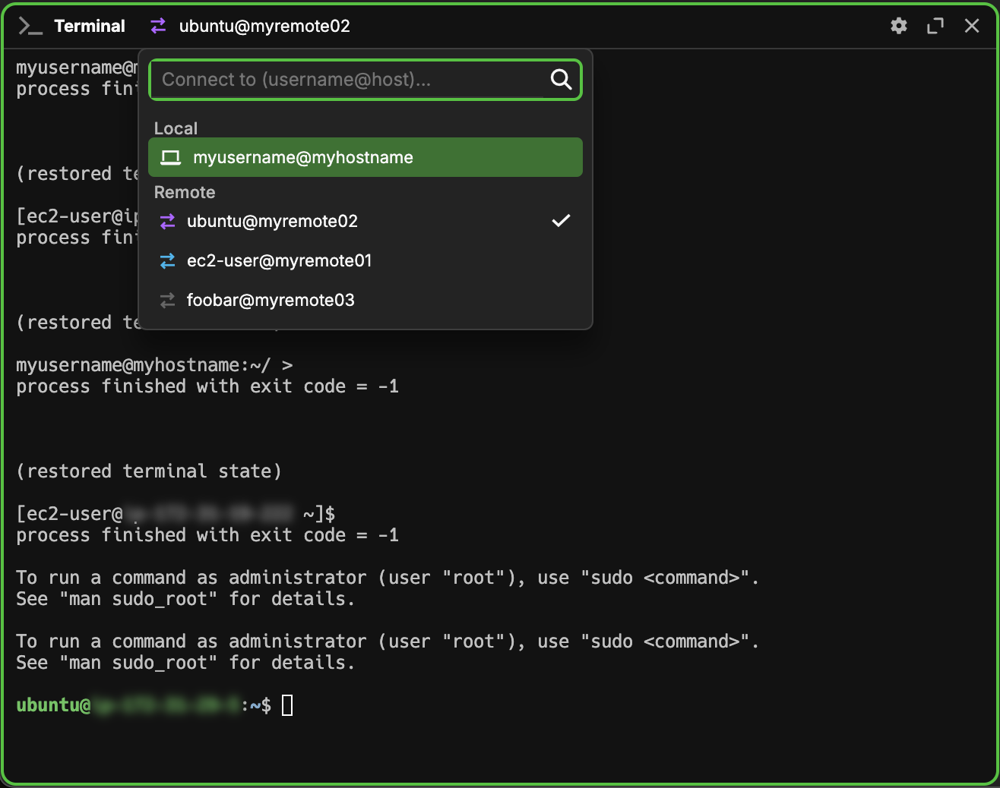

import { VersionBadge } from "@site/src/components/versionbadge";

# 连接 {#connections}

Snorkeling 允许用户连接到各种机器，并以保留各自独特行为的方式将它们统一到一起。目前，这包括 SSH 远程连接和本地 WSL 连接。

## 在块中访问连接 {#access-a-connection-in-a-block}

访问连接最简单的方式是点击 <i className="fa-sharp fa-laptop"/> 图标。然后可以根据想要连接的类型输入以下格式之一：

对于 SSH 连接：

- `[user]@[host]`
- `[host]`
- `[user]@[host]:[port]`

对于 WSL 连接：

- `wsl://<distribution name>`

或者，如果连接已存在于下拉列表中，可以直接点击它，也可以使用方向键导航到该项并按 Enter 连接。



## 不同类型的连接 {#different-types-of-connections}

由于连接有多种类型，并不是所有类型都能访问相同功能。SSH 和 WSL 连接始终可以在终端 widget 中工作；如果安装了 `wsh` shell 扩展，它们也可以在预览 widget 和 sysinfo widget 中工作。

## 什么是 wsh Shell 扩展？ {#what-are-wsh-shell-extensions}

`wsh` 是一个小程序，无论你当前连接到哪台机器，它都可以帮助管理 Snorkeling。它始终包含在你的主机上；连接 SSH 和 WSL 连接时，也可以选择安装它。如果安装到连接中，它会位于 `~/.snorkeling/bin/wsh`。随后，当 Snorkeling 连接到你的连接时（并且仅在 Snorkeling 连接到你的连接时），会发生以下事情：

- `~/.snorkeling/bin` 会被添加到该独立会话的 `PATH` 中。这样用户无需提供完整路径即可使用 `wsh` 命令。
- 多个环境变量会被注入到会话中，让某些 `wsh` 任务更容易完成。这些变量在[下方列出](#additional-environment-variables)。
- `connections.json` 中 `cmd:env` 条目里的用户自定义环境变量会被注入到会话中。
- 会运行位于 `connections.json` 中的用户自定义初始化脚本。关于这些脚本的更多信息，请参阅下面的章节。

如果由于某些原因失败，Snorkeling 会尝试在没有 `wsh` 的情况下运行。块标题中会出现一个小的 **<code><i className="fa-link-slash fa-solid fa-sharp"/></code>** 图标来表示这一点。关于 `wsh` 能力的更多信息，请参阅 [wsh 命令](/wsh)。当前 CLI 名称仍然是 `wsh`，这是兼容当前运行时的真实接口。

安装 `wsh` 后，你可以像查看主机一样查看远程机器上的某些 widget，例如 `files` 和 `sysinfo` widget。此外，`wsh` 还可用于影响多台机器上的 widget。举个简单例子，你可以在远程机器的终端窗口中使用 `wsh` 命令关闭主机上的某个 widget。关于可以用 `wsh` 完成哪些事情，请查看[这里](/wsh)。

### 额外环境变量 {#additional-environment-variables}

如上所述，为了方便用户，`wsh` 会在远程会话中注入一些环境变量。列表如下：

| 变量名        | 说明                                                                   |
| -------------------- | ----------------------------------------------------------------------------- |
| TERM_PROGRAM         | 当前仍设置为 `waveterm`，用于兼容上游接口。                                                    |
| WAVETERM             | 在 Snorkeling 管理的会话中设置，用于兼容上游接口。                                                     |
| WAVETERM_BLOCKID     | 包含当前终端 widget 的块 ID。                  |
| WAVETERM_CLIENTID    | 当前终端 widget 使用的 RPC Client ID。          |
| WAVETERM_CONN        | 当前终端 widget 使用的远程连接名称。 |
| WAVETERM_TABID       | 包含当前终端 widget 的标签页 ID。                    |
| WAVETERM_VERSION     | 当前 Snorkeling 应用版本。                                           |
| WAVETERM_WORKSPACEID | 包含当前终端 widget 的 workspace ID。              |

# 初始化脚本 {#initialization-scripts}

Snorkeling 提供了在连接远程机器时运行初始化脚本的选项。这些脚本定义在 `connections.json` 中，可以是脚本路径，也可以是直接写在文件中的短脚本。如果定义了多个脚本，会应用与当前 shell 最匹配的那个。脚本关键字如下：

| 脚本关键字      | 应用的 Shell |
| ------------------- | -------------------- |
| cmd:initscript      | 所有 shell           |
| cmd:initscript.sh   | bash 和 zsh         |
| cmd:initscript.bash | bash                 |
| cmd:initscript.zsh  | zsh                  |
| cmd:initscript.pwsh | pwsh                 |
| cmd:initscript.fish | fish                 |

## 向下拉列表添加新连接 {#add-a-new-connection-to-the-dropdown}

默认加载到下拉列表中的 SSH 值来自内部 `config/connections.json` 文件，以及对你的 `~/.ssh/config` 和 `/etc/ssh/ssh_config` 文件的解析。可以通过几种方式添加新连接：

- 在某个 ssh 配置文件中添加新的 `Host`，通常是 `~/.ssh/config` 文件
- 在内部 `config/connections.json` 文件中添加新条目
- 手动在连接框中输入连接（如果成功连接，该连接会被添加到内部 `config/connections.json` 文件中）
- 在终端中使用 `wsh ssh [user]@[host]`（如果成功连接，该连接会被添加到内部 `config/connections.json` 文件中）

WSL 连接会通过搜索 Windows 注册表中已安装的 WSL 发行版来添加。与 SSH 连接类似，它们也存在于 `config/connections.json` 文件中。

## SSH Config 解析 {#ssh-config-parsing}

目前，我们能够解析任何不包含 `Match` 关键字的 SSH config 文件。该关键字与我们使用的一个库不兼容，但我们希望很快修复这个问题。虽然所有其他有效关键字都会被解析，但目前只支持其中一小部分的功能：
| 关键字 | 说明 |
|---------|-------------|
| Host | 尝试通过 `[user]@[host]` 连接时用于匹配的模式。我们会列出不包含任何通配符（`*`、`?` 或 `!`）的主机。即使 host 模式包含通配符，在确定与各个键关联的值时，仍会照常解析。|
| User | SSH 远程连接的用户。如果未指定，默认使用本地机器上的当前用户。|
|HostName| 要登录机器的真实主机名。也可以根据需要使用 IP 地址。如果未指定，默认使用 Host。
| Port | 连接远程机器所用的端口。如果未指定，默认为 `22`。|
| IdentityFile | 每个 host 可以指定多次。它给出用于连接身份验证的私有身份文件路径（id_rsa、id_ed25519、id_ecdsa 等）。这些文件会按顺序尝试，也可以按需使用密码短语加密。如果未设置值，默认按顺序尝试：~/.ssh/id_rsa、~/.ssh/id_ecdsa、~/.ssh/id_ecdsa_sk、~/.ssh/id_ed25519_sk、~/.ssh/id_dsa。|
|BatchMode| 如果设置为 true，将禁用通过密码、challenge/response 和公钥密码短语认证进行的用户交互。默认设置为 false。|
|PubkeyAuthentication|（部分支持）用于指定是否应尝试公钥认证。目前是部分实现，`unbound` 和 `host-bound` 值的行为与 `yes` 相同。默认值为 `yes`。|
|PasswordAuthentication| 用于指定是否应尝试密码认证。默认值为 `yes`。|
|KbdInteractiveAuthentication| 用于指定是否应尝试键盘交互式认证。默认值为 `yes`。|
|PreferredAuthentications|（部分支持）指定客户端尝试认证的顺序。目前是部分实现，不支持 `gssapi-with-mic` 或 `hostbased` 认证。默认值为 `publickey,keyboard-interactive,password`。|
|AddKeysToAgent|（部分支持）如果启用，此选项会自动将密钥及其对应密码短语添加到正在运行的 ssh agent。它是部分支持的，只接受 `yes` 和 `no` 作为有效输入。其他输入（例如 `confirm` 或时间间隔）的行为与 `no` 相同。默认值为 `no`。|
|IdentityAgent| 指定用于与 SSH Agent 通信的 Unix Domain Socket。它用于覆盖 SSH_AUTH_SOCK identity agent。|
|IdentitiesOnly| 指定只应使用指定的认证身份文件。这些文件可以是默认文件，也可以是通过 IdentityFile 关键字指定的文件。可接受 `yes` 或 `no`。默认值为 `no`。|
|ProxyJump| 以逗号分隔列表指定一个或多个跳板代理。在连接到目标连接（同样使用 TCP 转发）之前，会通过 TCP 转发依次访问这些代理。可以设置为 `none` 以禁用该功能。|
|UserKnownHostsFile| 提供一个或多个用户主机密钥数据库文件的位置，用于记录受信任的远程连接。文件名输入在同一个字符串中，并以空白分隔。默认值为 `"~/.ssh/known_hosts ~/.ssh/known_hosts2"`。|
|GlobalKnownHostsFile| 提供一个或多个全局主机密钥数据库文件的位置，用于记录受信任的远程连接。文件名输入在同一个字符串中，并以空白分隔。默认值为 `"/etc/ssh/ssh_known_hosts /etc/ssh/ssh_known_hosts2"`。|

### SSH Config Host 示例 {#example-ssh-config-host}

举个简短例子，你配置文件中的某个 host 可能如下：

```
Host myhost
   User username
   HostName 203.0.113.254
   IdentityFile ~/.ssh/id_rsa
   AddKeysToAgent yes
```

随后，你可以用 `myhost` 或 `username@myhost` 访问此连接。如果想手动指定端口（例如 2222），可以在配置文件中添加 `Port 2222`，或者连接到 `username@myhost:2222`。

## 内部 SSH 配置 {#internal-ssh-configuration}

除了常规 ssh config 文件，Snorkeling 还拥有自己的配置文件，用于管理单独变量。这些变量包括：
| 关键字 | 说明 |
|---------|-------------|
| conn:wshenabled | 此布尔值允许连接使用 `wsh`；如果设置为 `false`，该连接将永远不会使用 `wsh`。默认为 `true`。|
| conn:askbeforewshinstall | 此布尔值用于在安装 wsh 前提示用户。如果设置为 false，`wsh` 会自动安装且不提示。默认为 `true`。|
| conn:wshpath | 表示连接上 `wsh` 可执行文件路径的字符串。默认为 `"~/.snorkeling/bin/wsh"`。|
| conn:shellpath | 表示连接上 shell 可执行文件路径的字符串。如果未设置，将使用连接上 `$SHELL` 的输出。|
| conn:ignoresshconfig | 此布尔值允许 Snorkeling 在解析此连接关键字时忽略 `~/.ssh/config` 文件。会使用常规默认值，但对这些默认值的所有修改都必须改为在 `connections.json` 文件中指定。默认值为 false。|
| display:hidden | 此布尔值会从下拉列表中隐藏该连接。默认为 `false`。 |
| display:order | 此浮点数决定连接在连接下拉列表中的顺序。默认为 `0`。|
| term:fontsize | 此整数可用于覆盖使用此连接的块的终端字号。块元数据优先于此设置。默认为 null，表示改用全局设置。 |
| term:fontfamily | 此字符串可用于为使用此连接的块指定终端字体族。块元数据优先于此设置。默认为 null，表示改用全局设置。 |
| term:theme | 此字符串可用于为使用此连接的块指定终端主题。块元数据优先于此设置。默认为 null，表示改用全局设置。 |
| cmd:env | 一个 json 对象，包含环境变量键值对，以及这些变量在该远程连接中应设置的值。仅在启用 `wsh` 时有效。
| cmd:initscript | 使用任意 shell 初始化此连接时运行的脚本或脚本路径。仅在启用 `wsh` 时有效。 |
| cmd:initscript.sh | 使用 `bash` 或 `zsh` 等 POSIX shell 初始化此连接时运行的脚本或脚本路径。仅在启用 `wsh` 时有效。
| cmd:initscript.bash | 使用 `bash` shell 初始化此连接时运行的脚本或脚本路径。仅在启用 `wsh` 时有效。 |
| cmd:initscript.zsh | 使用 `zsh` shell 初始化此连接时运行的脚本或脚本路径。仅在启用 `wsh` 时有效。 |
| cmd:initscript.pwsh | 使用 `pwsh` shell 初始化此连接时运行的脚本或脚本路径。仅在启用 `wsh` 时有效。 |
| cmd:initscript.fish | 使用 `fish` shell 初始化此连接时运行的脚本或脚本路径。仅在启用 `wsh` 时有效。 |
| ssh:user | 表示连接用户名的字符串。可用于覆盖 `~/.ssh/config` 中的值，或在忽略 ssh config 时设置该值。|
| ssh:hostname | 表示连接内部主机名的字符串。可用于覆盖 `~/.ssh/config` 中的值，或在忽略 ssh config 时设置该值。|
| ssh:port | 表示连接所用数字端口的字符串。可用于覆盖 `~/.ssh/config` 中的值，或在忽略 ssh config 时设置该值。|
| ssh:identityfile | 包含将要使用的身份文件路径的字符串列表。如果使用 `-i` 标志的 `wsh ssh` 命令成功，身份文件会自动添加到这里。它们会先于 `~/.ssh/config` 中的值使用。|
| ssh:identitiesonly | 一个布尔值，表示是否只使用指定身份文件。这意味着只使用通过 `ssh:identityfile` 标志设置的文件或默认文件。可用于覆盖 `~/.ssh/config` 中的值，或在忽略 ssh config 时设置该值。|
| ssh:batchmode | 一个布尔值，表示是否跳过密码和密码短语提示。可用于覆盖 `~/.ssh/config` 中的值，或在忽略 ssh config 时设置该值。|
| ssh:pubkeyauthentication | 一个布尔值，表示是否启用公钥认证。可用于覆盖 `~/.ssh/config` 中的值，或在忽略 ssh config 时设置该值。|
| ssh:passwordauthentication | 一个布尔值，表示是否启用密码认证。可用于覆盖 `~/.ssh/config` 中的值，或在忽略 ssh config 时设置该值。 |
| ssh:passwordsecretname | 指定存储在 [secret store](/secrets) 中的 secret 名称的字符串，用作 SSH 密码。设置后，该密码会自动用于密码认证，而不会提示用户输入。 <VersionBadge version="v0.13" /> |
| ssh:kbdinteractiveauthentication | 一个布尔值，表示是否启用键盘交互式认证。可用于覆盖 `~/.ssh/config` 中的值，或在忽略 ssh config 时设置该值。 |
| ssh:preferredauthentications | 一个字符串列表，表示不同认证类型的顺序。每种认证类型会按顺序尝试。支持 `"publickey"`、`"keyboard-interactive"` 和 `"password"` 作为有效类型。其他认证类型不会处理并会被跳过。可用于覆盖 `~/.ssh/config` 中的值，或在忽略 ssh config 时设置该值。|
| ssh:addkeystoagent | 一个布尔值，表示是否应将连接使用的密钥添加到 ssh agent。可用于覆盖 `~/.ssh/config` 中的值，或在忽略 ssh config 时设置该值。|
| ssh:identityagent | 给出 identity agent 的 Unix domain socket 路径的字符串。可用于覆盖 `~/.ssh/config` 中的值，或在忽略 ssh config 时设置该值。|
| ssh:proxyjump | 一个字符串列表，指定为建立连接而必须依次通过 TCP 转发访问的主机名。可用于覆盖 `~/.ssh/config` 中的值，或在忽略 ssh config 时设置该值。|
| ssh:userknownhostsfile | 一个列表，包含用于跟踪授权连接的任意用户主机密钥数据库文件路径。可用于覆盖 `~/.ssh/config` 中的值，或在忽略 ssh config 时设置该值。|
| ssh:globalknownhostsfile | 一个列表，包含用于跟踪授权连接的任意全局主机密钥数据库文件路径。可用于覆盖 `~/.ssh/config` 中的值，或在忽略 ssh config 时设置该值。|

### SSH Agent 检测 {#ssh-agent-detection}

Snorkeling 会按以下顺序解析 identity agent 路径：

- 如果为连接设置了 `ssh:identityagent`（或 SSH config 中的 `IdentityAgent`），则使用该 socket 或 pipe。
- 如果未在 Windows 上设置，Snorkeling 会回退到内置 OpenSSH agent pipe `\\.\pipe\openssh-ssh-agent`。请确保 **OpenSSH Authentication Agent** 服务正在运行。
- 如果未在 macOS/Linux 上设置，Snorkeling 会查询你的 shell 环境中的 `SSH_AUTH_SOCK`，以自动检测 agent 路径。

### 内部配置示例 {#example-internal-configurations}

下面是几个使用内部配置文件 `connections.json` 可以完成的操作示例：

#### 隐藏连接 {#hiding-a-connection}

假设你的 `~/.ssh/config` 文件中有一个名为 `github.com` 的连接，它在连接下拉列表中显示为 `git@github.com`。虽然出于认证原因它确实应该保留在配置文件中，但它并不涉及连接到远程环境，因此没有必要出现在下拉列表中。在这种情况下，可以像下面这样隐藏它：

```json
{
    <... other connections go here ...>,
    "git@github.com" : {
        "display:hidden": true
    },
    <... other connections go here ...>
}
```

#### 移动连接 {#moving-a-connection}

假设你有一个名为 `rarelyused` 的连接，它在连接下拉列表中显示为 `myusername@rarelyused:9999`。由于它很少使用，你可能希望把它移到列表更靠后的位置。在这种情况下，可以像下面这样移动它：

```json
{
    <... other connections go here ...>,
    "myusername@rarelyused:9999" : {
        "display:order": 100
    },
    <... other connections go here ...>
}
```

#### 设置连接主题 {#theming-a-connection}

假设你有一个名为 `myhost` 的连接，它在连接下拉列表中显示为 `myusername@myhost`。你经常使用这个连接，但总是把它和本地连接混淆。在这种情况下，可以使用内部配置文件为它设置不同样式。例如：

```json
{
    <... other connections go here ...>,
    "myusername@myhost" : {
        "term:theme": "warmyellow",
        "term:fontsize": 16,
        "term:fontfamily": "menlo"
    },
    <... other connections go here ...>
}
```

此样式、字号和字体族随后只会应用到使用该连接的 widget。

### 完全在内部定义 {#entirely-defined-internally}

假设你想设置一个连接，但不想学习 `~/.ssh/config` 的语法。在这种情况下，可以完全在 `connections.json` 文件中定义连接。例如：

```json
{
    <... other connections go here ...>,
    "myusername@myhost" : {
        "ssh:hostname": "190.0.2.0",
        "ssh:identityfile": ["~/.ssh/myidentityfile"],
        "ssh:identitiesonly": true,
        "ssh:addkeystoagent": true
    },
    <... other connections go here ...>
}
```

这会创建一个连接，而不要求该连接存在于 `~/.ssh/config` 文件中。示例中还额外设置了几个选项，展示了如何完成这类配置。

### 为某个连接禁用 wsh {#disabling-wsh-for-a-connection}

虽然 Snorkeling 在首次连接远程时提供了禁用 `wsh` 的选项，但有些情况下你可能希望之后再禁用它。最简单的方法是编辑 `connections.json` 文件。假设该连接在下拉列表中显示为 `root@wshless`，那么可以使用下面这一行手动禁用：

```json
{
    <... other connections go here ...>,
    "root@wshless" : {
        "conn:enablewsh": false,
    },
    <... other connections go here ...>
}
```

请注意，如果你在首次连接时在 GUI 中选择禁用 `wsh`，同一行也会自动添加到你的 `connections.json` 文件中。

## 使用 CLI 管理连接 {#managing-connections-with-the-cli}

`wsh` 命令提供了一些专门用于与连接交互的命令。可以在[这里](/wsh-reference#conn)查看。

## 连接故障排除 {#troubleshooting-connections}

### 日志文件 {#log-files}

如果连接出现问题，最简单的第一步是在尝试连接的终端 widget 中启用调试。为此，请点击 **<code><i className="fa-gear fa-solid fa-sharp"/></code>** 按钮，并悬停在 **`Debug Connection`** 项上。随后可以选择两个日志级别：`Info` 和 `Verbose`。完成后，连接期间调试信息会打印到终端中。

如果这还不够，也可以查看完整日志文件。为此，可以运行命令 `wsh wavepath log` 获取日志文件位置。`wavepath` 子命令名当前仍保留用于兼容。

### 已知限制 {#known-limitations}

如果设置 `wsh` 时出错，你的连接仍会在没有 `wsh` 的情况下启动。不过，根据调试信息，可能有几类原因会导致这种情况。

#### Shell 类型 {#shell-type}

Snorkeling 可以在以下 shell 中注入 `wsh`：

- bash
- zsh
- pwsh (powershell)
- fish

如果 shell 不属于以上类型，`wsh` 命令可能默认无法工作。目前最简单的修复方式是切换 shell 类型。可以在要使用的连接对应的 `connections.json` 中，将 `conn:shellpath` 值设置为上述某个 shell 的路径。或者，也可以使用 `chsh` 命令更改该连接中的 shell，但这也会在 Snorkeling 之外生效。完成后，重启 Snorkeling 让更改生效。

#### sshd 中的 AllowTcpForwarding {#allowtcpforwarding-in-sshd}

某些系统的 sshd 默认配置为禁用 TCP 转发。可以在该连接上的 `/etc/ssh/sshd_config` 文件中找到此配置。在该文件中搜索包含 `AllowTcpForwarding` 的行。如果它被设置为 `no`，这很可能就是 `wsh` 无法在该连接上工作的原因。为了让 `wsh` 正常工作，请将 `AllowTcpForwarding` 的值设置为 `yes` 或 `local`（两者提供的权限级别不同，但在此场景下都可用）。然后，使用远程机器提供的任意方法重启 `sshd` 服务。完成后重启 Snorkeling，使其用这项更改重新连接。
