# 自定义 Widget {#custom-widgets}

Wave 允许用户创建自己的 widget，以适合自己的方式定制使用体验。虽然我们计划在未来大幅扩展这项能力，但现在已经可以创建一些一键访问的 widget。所有 widget 都可以通过修改 `<WAVETERM_HOME>/config/widgets.json` 文件来创建。向这个文件添加 widget 后，就可以把它加入 widget 栏。默认情况下，widget 栏如下所示：
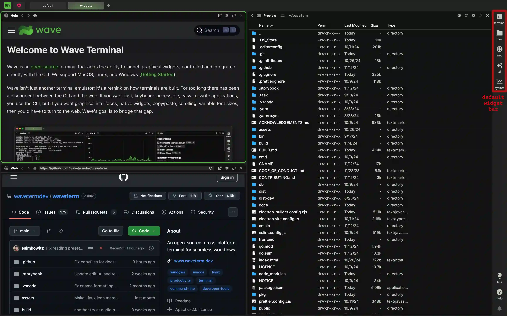

添加额外 widget 后，可以得到类似下面这样的 widget 栏：

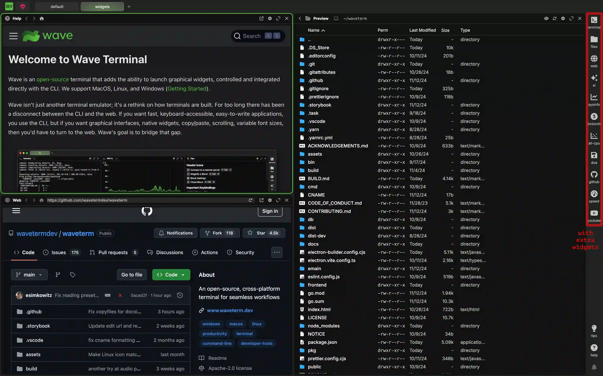

## Widget 的结构 {#the-structure-of-a-widget}

所有 widget 都共享相似的结构，大致类似下面的示例：

```json
"<widget name>": {
    "icon": "<font awesome icon name>",
    "label": "<the text label of the widget>",
    "color": "<the color of the label>",
    "blockdef": {
        "meta": {
            "view": "term",
            "controller": "cmd",
            "cmd": "<the actual cli command>"
        }
    }
}
```

它由几个不同部分组成。首先，每个 widget 都有一个唯一标识名称。与该名称关联的值是外层 `WidgetConfigType`。下图中用红色标出了它：

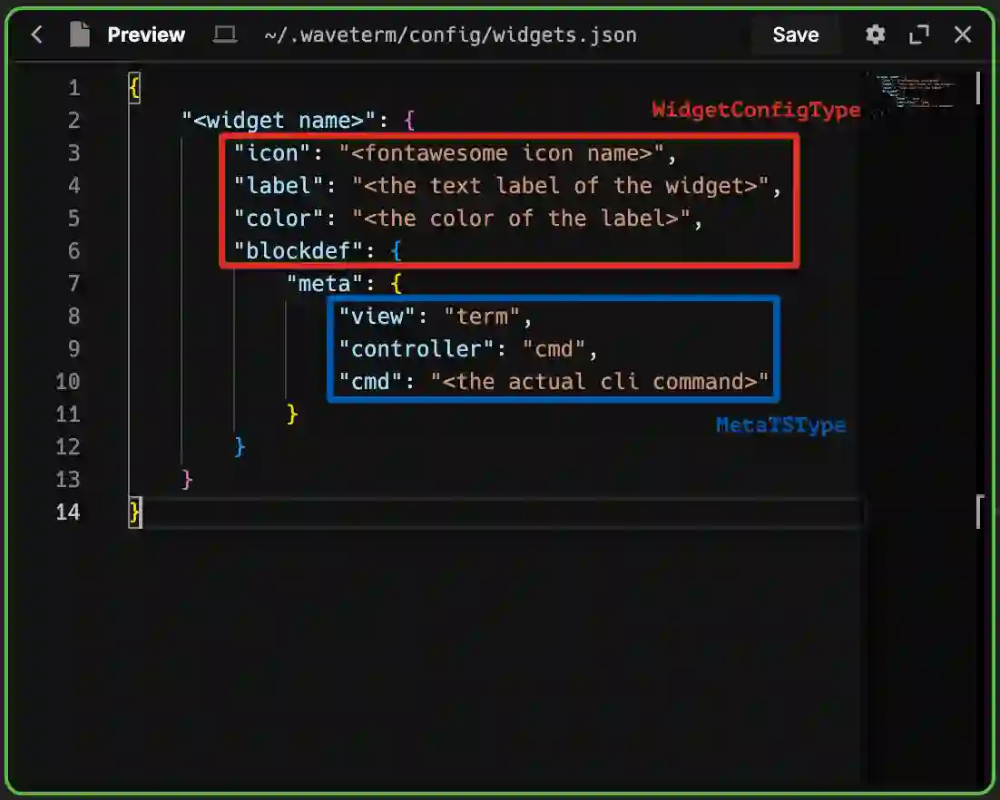

这个 `WidgetConfigType` 在所有类型的 widget 之间共享。也就是说，所有 widget，无论类型如何，都会使用这里相同的一组键。接受的键如下：

| 键 | 描述 |
| --- | --- |
| "display:order" | （可选）如果你希望 widget 的顺序不同于 `widgets.json` 文件中的顺序，可以用数字覆盖 widget 排序。默认为 0。 |
| "icon" | （可选）[Font Awesome 图标](#font-awesome-icons)的名称。默认为 `"browser"`。 |
| "color" | （可选）表示 CSS 颜色的字符串。可以使用十六进制颜色和自定义 CSS 属性。默认值为 `"var(--secondary-text-color)"`，这是 Wave 用于区分次要文本的颜色。开箱默认是 `"#c3c8c2"`。 |
| "label" | （可选）表示 widget 下方标签的字符串。如果没有填写 `"description"` 键，它也会在 hover 时作为 tooltip 显示。默认值为 null。 |
| "description" | （可选）描述 widget 的作用。如果指定了该字段，它会在 hover 时作为 tooltip。默认值为 null。 |
| "magnified" | （可选）布尔值，表示 widget 是否应以放大状态启动。默认为 false。 |
| "action" | （可选）运行内置前端动作，而不是创建 block。目前支持 `"commontext:search"`，用于打开 Common Text 搜索。 |
| "blockdef" | 定义 widget 创建的 block。注意，所有后续定义都在该对象内部的 meta 对象中进行。不使用 `"action"` 的 widget 必须提供该字段。 |

<a name="font-awesome-icons" />
:::info

**Font Awesome 图标**

[Font Awesome](https://fontawesome.com/search) 提供了大量实用图标，你可以把它们用作应用中的 widget 图标。最简单的用法是只提供图标名，它就会被使用。例如，字符串 `"house"` 会提供一个包含房子的图标。我们也允许你通过如下方式修改名称，为图标应用几种不同样式：

| 格式 | 描述 |
| --- | --- |
| &lt;icon&nbsp;name&gt; | 普通图标，不应用额外样式。 |
| solid@&lt;icon&nbsp;name&gt; | 向图标添加 `fa-solid` 类，使内容使用填充颜色，而不是保留背景。 |
| regular@&lt;icon&nbsp;name&gt; | 向图标添加 `fa-regular` 类，确保内容不使用填充颜色，而是使用标准描边。 |
| brands@&lt;icon&nbsp;name&gt; | 对品牌图标添加必需的 `fa-brands` 类。没有它，品牌图标无法正确渲染。该格式不适用于非品牌图标。 |

:::

其他选项属于内层 `MetaTSType`（图中蓝色标注部分）。它包含 widget 实际工作方式的全部细节。有效键会因 widget 类型而异，下面会逐一展开说明。

## 终端和 CLI Widget {#terminal-and-cli-widgets}

终端 widget 或 CLI widget 是一种简单打开终端并运行 CLI 命令的 widget。它们通常类似下面的示例：

```json
{
    <... other widgets go here ...>,
    "<widget name>": {
        "icon": "<font awesome icon name>",
        "label": "<the text label of the widget>",
        "color": "<the color of the label>",
        "blockdef": {
            "meta": {
                "view": "term",
                "controller": "cmd",
                "cmd": "<the actual cli command>"
            }
        }
    },
    <... other widgets go here ...>
}
```

`WidgetConfigType` 使用所有 widget 通用的常规选项。`MetaTSType` 可以包含下列键：

| 键 | 描述 |
| --- | --- |
| "view" | 指定 widget 一般类型的字符串。对于自定义终端 widget，必须设为 `"term"`。 |
| "controller" | 指定所用命令类型的字符串。对于更持久的 shell 会话，设置为 `"shell"`。对于一次性命令，设置为 `"cmd"`。设置为 `"cmd"` 时，widget 头部会额外显示一个刷新按钮，用于重新运行命令。 |
| "cmd" | （可选）当 `"controller"` 设为 `"cmd"` 时，该选项提供要运行的实际命令。注意，由于它是作为命令运行的，除非你启动的命令本身包含 shell 会话，否则不会有 shell 会话。默认为空字符串。 |
| "cmd:args" | （可选，字符串数组）传递给 `cmd` 的参数。 |
| "cmd:shell" | （可选）如果 `cmd:shell` 为 false（默认），则使用 `cmd` + `cmd:args`（适合传递给 `execve`）。如果 `cmd:shell` 为 true，则只使用 `cmd`，并且 `cmd` 可以包含空格和 shell 语法，例如管道或重定向等。 |
| "cmd:interactive" | （可选）当 `"controller"` 设为 `"term"` 时，这个布尔值会向启动的终端添加 interactive 标志。默认为 false。 |
| "cmd:login" | （可选）当 `"controller"` 设为 `"term"` 时，这个布尔值会向 term 命令添加 login 标志。默认为 false。 |
| "cmd:runonstart" | （可选）创建 block 或应用启动时会重新运行该命令。没有它时，你必须手动运行命令。默认为 true。 |
| "cmd:runonce" | （可选）启动时运行，但随后会把 `"cmd:runonce"` 和 `"cmd:runonstart"` 设为 false（因此后续运行需要手动重启）。 |
| "cmd:clearonstart" | （可选）运行 cmd 时清空 block 内容。默认为 false。 |
| "cmd:closeonexit" | （可选）如果命令成功退出（退出码 = 0），自动关闭 block。 |
| "cmd:closeonexitforce" | （可选）命令退出时自动关闭 block，无论成功还是失败。 |
| "cmd:closeonexitdelay | （可选）修改命令退出到 block 关闭之间的延迟，单位为毫秒，默认 2000。 |
| "cmd:env" | （可选）表示命令运行时环境变量的键值对象。默认为空对象。 |
| "cmd:cwd" | （可选）表示在目标主机上运行命令或 shell 时当前工作目录的字符串。本地路径会在本机展开 `~`；远程路径会保留 `~`，由远程 shell 展开。默认为 home 目录。 |
| "cmd:nowsh" | （可选）布尔值，用于关闭该命令的 wsh 集成。默认为 false。 |
| "cmd:jwt" | （可选）布尔值，强制向环境中添加 JWT token。作为 widget 运行 waveapp 时必需（本地和远程都需要）。默认为 false。 |
| "term:localshellpath" | （可选）设置运行 widget 命令所用的 shell。仅本地有效。留空时，Wave 会改用系统默认 shell。 |
| "term:localshellopts" | （可选）设置与 `"term:localshellpath"` 配合使用的 shell 选项。如果你使用非标准 shell，并且需要提供我们未覆盖的特定选项，这会很有用。仅本地有效。默认为空字符串。 |
| "cmd:initscript" | （可选）仅适用于 `"shell"` controller。在启动 shell 前运行的初始化脚本（可以是内联脚本或绝对本地文件路径）。 |
| cmd:initscript.sh" | （可选）与 `cmd:initscript` 相同，但仅适用于 bash/zsh shell。 |
| cmd:initscript.bash" | （可选）与 `cmd:initscript` 相同，但仅适用于 bash shell。 |
| cmd:initscript.zsh" | （可选）与 `cmd:initscript` 相同，但仅适用于 zsh shell。 |
| cmd:initscript.pwsh" | （可选）与 `cmd:initscript` 相同，但仅适用于 pwsh/powershell shell。 |
| cmd:initscript.fish" | （可选）与 `cmd:initscript` 相同，但仅适用于 fish shell。 |

### 本地 Shell Widget 示例 {#example-local-shell-widgets}

如果你的机器上安装了多个 shell，有时你可能希望使用非默认 shell。对于这种情况，可以很容易地为每个 shell 创建一个 widget。

假设你希望创建一个启动 `fish` shell 的 widget。系统中安装 `fish` 后，可以像下面这样定义 widget：

```json
{
    <... other widgets go here ...>,
    "fish" : {
        "icon": "fish",
        "color": "#4abc39",
        "label": "fish",
        "blockdef": {
            "meta": {
                "view": "term",
                "controller": "shell",
                "term:localshellpath": "/usr/local/bin/fish",
                "term:localshellopts": "-i -l"
            }
        }
    },
    <... other widgets go here ...>
}
```

这会向 widget 栏添加一个图标，点击后会启动运行 `fish` shell 的终端。
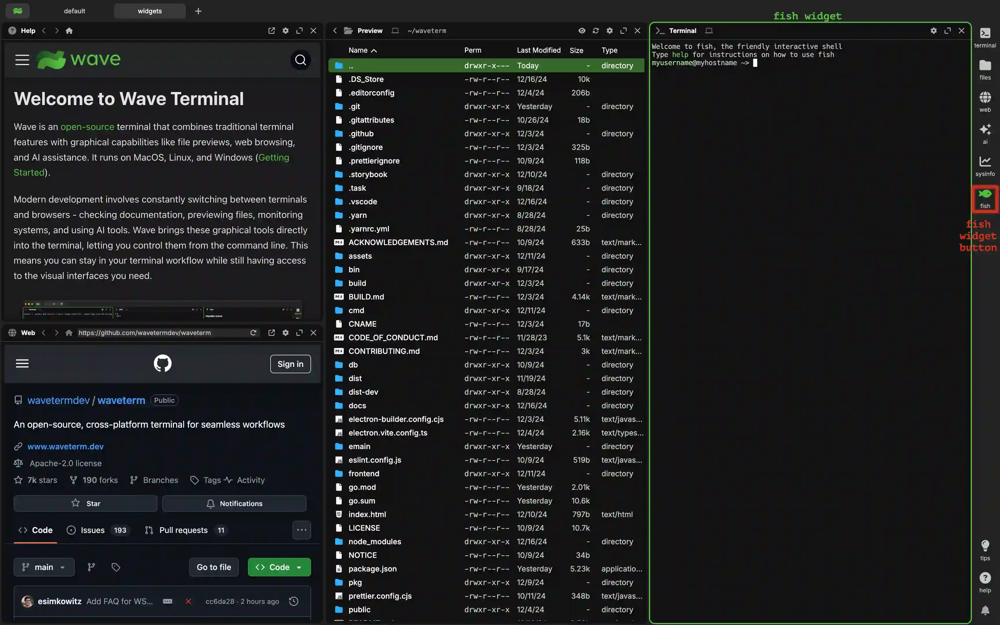

:::info
`fish` 可能不在你的 PATH 中。如果确实如此，把 `"fish"` 用作 `"term:localshellpath"` 的值将无法工作。在这些情况下，你需要提供它的直接路径。它通常位于类似 `"/usr/local/bin/fish"` 的位置，但你的系统可能不同。
:::

如果你想为 Powershell Core 或 `pwsh` 做同样的事，可以这样定义 widget：

```json
{
    <... other widgets go here ...>,
    "pwsh" : {
        "icon": "rectangle-terminal",
        "color": "#2671be",
        "label": "pwsh",
        "blockdef": {
            "meta": {
                "view": "term",
                "controller": "shell",
                "term:localshellpath": "pwsh"
            }
        }
    },
    <... other widgets go here ...>
}
```

这会向 widget 栏添加一个图标，点击后会启动运行 `pwsh` shell 的终端。
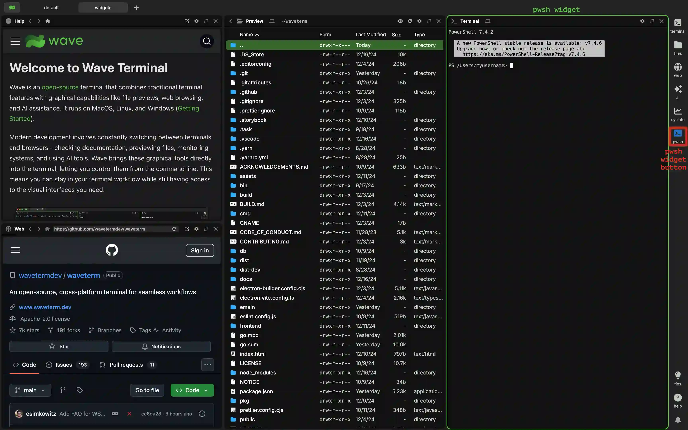

:::info
`pwsh` 可能不在你的 PATH 中。如果确实如此，把 `"pwsh"` 用作 `"term:localshellpath"` 的值将无法工作。在这些情况下，你需要提供它的直接路径。在 Unix 系统上它可能类似 `"/usr/local/bin/pwsh"`，在 Windows 上可能类似 <code>"C:\\Program&nbsp;Files\\PowerShell\\7\\pwsh.exe"</code>，但你的系统可能不同。另请注意，`pwsh.exe` 和 `pwsh` 在 Windows 上都可用，但在 Unix 系统上只有 `pwsh` 可用。
:::

### 远程 Shell Widget 示例 {#example-remote-shell-widgets}

如果你想为某个特定连接（SSH 或 WSL）打开终端 widget，可以使用 `connection` meta 键。连接键的值应与 `connections.json` 匹配（或与你的连接下拉菜单中的值匹配）。注意，你应该只使用规范名称，不要使用你设置过的任何自定义 `"display:name"`。对于 WSL，它可能类似 `wsl://Ubuntu`；对于 SSH 连接，它可能类似 `user@remotehostname`。

```json
{
	<... other widgets go here ...>,
	"remote-term": {
		"icon": "rectangle-terminal",
		"label": "remote",
		"blockdef": {
			"meta": {
				"view": "term",
				"controller": "shell",
				"connection": "<connection>"
			}
		}
	},
	<... other widgets go here ...>
}
```

### Cmd Widget 示例 {#example-cmd-widgets}

下面是几个简单的 cmd widget 示例。

假设我想要一个打开时运行 speedtest-go 的 widget。那么可以像下面这样定义：

```json
{
    <... other widgets go here ...>,
    "speedtest" : {
        "icon": "gauge-high",
        "label": "speed",
        "blockdef": {
            "meta": {
                "view": "term",
                "controller": "cmd",
                "cmd": "speedtest-go --unix",
                "cmd:clearonstart": true
            }
        }
    },
    <... other widgets go here ...>
}
```

这会向 widget 栏添加一个图标，点击后会启动运行 `speedtest-go --unix` 命令的终端。
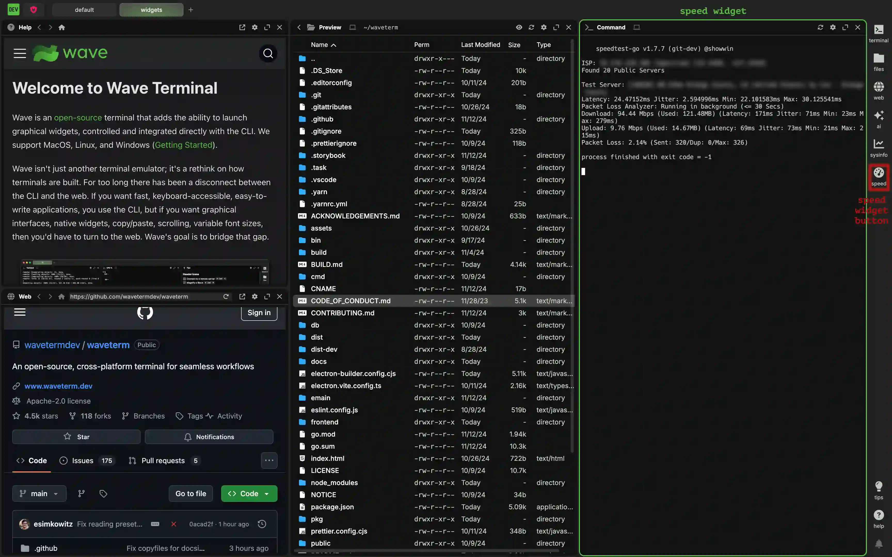

使用 `"cmd"` 作为 `"controller"` 是完成这件事最简单的方式。`"cmd:clearonstart"` 不是必需的，但它会让命令每次运行时（可以通过右键点击标题并选择 `Force Controller Restart` 完成）清空之前的内容。

现在假设我想运行一个 TUI 应用，例如 `dua`。事实证明，你基本上可以用同样的方式完成：

```json
{
    <... other widgets go here ...>,
    "dua" : {
        "icon": "brands@linux",
        "label": "dua",
        "blockdef": {
            "meta": {
                "view": "term",
                "controller": "cmd",
                "cmd": "dua"
            }
        }
    },
    <... other widgets go here ...>
}
```

这会向 widget 栏添加一个图标，点击后会启动运行 `dua` 命令的终端。
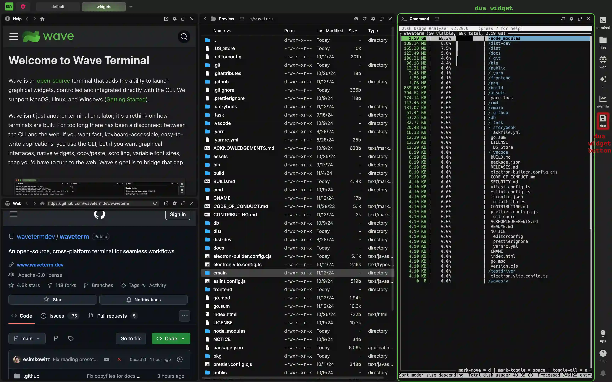

由于这是一个关闭后不返回内容的 TUI 应用，`"cmd:clearonstart"` 选项不会改变行为，因此这里省略了它。

## Web Widget {#web-widgets}

有时你会希望直接打开某个网站页面。创建自定义 `"web"` widget 就能很容易地完成。它们通常采用下面的形式：

```json
{
    <... other widgets go here ...>,
    "<widget name>": {
        "icon": "<font awesome icon name>",
        "label": "<the text label of the widget>",
        "color": "<the color of the label>",
        "blockdef": {
            "meta": {
                "view": "web",
                "url": "<url of the first webpage>"
            }
        }
    },
    <... other widgets go here ...>
}
```

`WidgetConfigType` 使用所有 widget 通用的常规选项。`MetaTSType` 可以包含下列键：

| 键 | 描述 |
| --- | --- |
| "view" | 指定 widget 一般类型的字符串。对于自定义 web widget，必须设为 `"web"`。 |
| "url" | 当前页面 URL 字符串。作为 widget 的一部分时，它会作为 widget 的起始页面。如果未指定，则默认使用全局可配置的 `"web:defaulturl"`；全新安装时该值为 [https://github.com/wavetermdev/waveterm](https://github.com/wavetermdev/waveterm)。 |
| "pinnedurl" | （可选）主页按钮会打开的 URL。如果未指定，则默认使用全局可配置的 `"web:defaulturl"`；全新安装时该值为 [https://github.com/wavetermdev/waveterm](https://github.com/wavetermdev/waveterm)。 |

### Web Widget 示例 {#example-web-widgets}

假设你想要一个自动从 YouTube 开始，并使用 YouTube 作为主页的 widget。可以这样配置：

```json
{
    <... other widgets go here ...>,
    "youtube" : {
        "icon": "brands@youtube",
        "label": "youtube",
        "blockdef": {
            "meta": {
                "view": "web",
                "url": "https://youtube.com",
                "pinnedurl": "https://youtube.com"
            }
        }
    },
    <... other widgets go here ...>
}
```

这会向 widget 栏添加一个图标，点击后会在 youtube 主页启动 web widget。
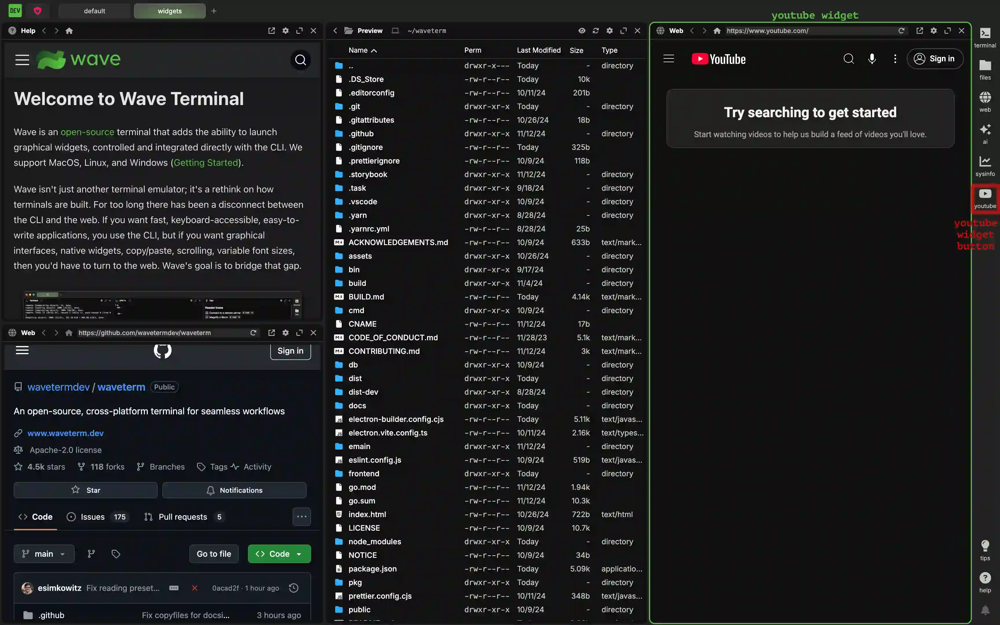

另外，假设你想要一个像书签一样打开 github 的 web widget，但之后使用 google 作为主页。可以很容易地这样配置：

```json
{
    <... other widgets go here ...>,
    "github" : {
        "icon": "brands@github",
        "label": "github",
        "blockdef": {
            "meta": {
                "view": "web",
                "url": "https://github.com",
                "pinnedurl": "https://google.com"
            }
        }
    },
    <... other widgets go here ...>
}
```

这会向 widget 栏添加一个图标，点击后会在 github 主页启动 web widget。
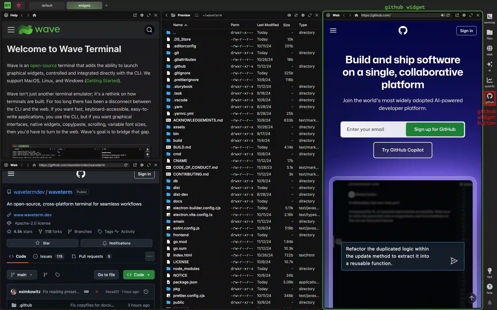

## Sysinfo Widget {#sysinfo-widgets}

Sysinfo Widget 有意只保留很小一部分可选值，我们会随时间扩展它。但你仍然可以配置自己的版本，例如，如果你希望默认加载不同的图表。这个 widget 的一般形式为：

```json
{
    <... other widgets go here ...>,
    "<widget name>": {
        "icon": "<font awesome icon name>",
        "label": "<the text label of the widget>",
        "color": "<the color of the label>",
        "blockdef": {
            "meta": {
                "view": "sysinfo",
                "graph:numpoints": <the max number of points in the graph>,
                "sysinfo:type": <the name of the plot collection>,
            }
        }
    },
    <... other widgets go here ...>
}
```

`WidgetConfigType` 使用所有 widget 通用的常规选项。`MetaTSType` 可以包含下列键：

| 键 | 描述 |
| --- | --- |
| "view" | 指定 widget 一般类型的字符串。对于自定义 sysinfo widget，必须设为 `"sysinfo"`。 |
| "graph:numpoints" | 图表上可以显示的最大点数。等价地，也就是图表窗口覆盖的秒数。默认为 100。 |
| "sysinfo:type" | 表示要在图表上显示的类型集合的字符串。有效值为 `"CPU"`、`"Mem"`、`"CPU + Mem"` 和 `All CPU`。注意这些值区分大小写。如果未提供值，图表默认显示 `"CPU"`。 |

### Sysinfo Widget 示例 {#example-sysinfo-widgets}

假设你有一个持续 3 分钟的构建过程，并且希望能在 sysinfo 图表上看到完整构建过程。同时，你很想同时查看 CPU 和内存，因为两者都会受到这个过程影响。这种情况下，可以按下面方式设置 widget：

```json
{
    <... other widgets go here ...>,
    "3min-info" : {
        "icon": "circle-3",
        "label": "3mininfo",
        "blockdef": {
            "meta": {
                "view": "sysinfo",
                "graph:numpoints": 180,
                "sysinfo:type": "CPU + Mem"
            }
        }
    },
    <... other widgets go here ...>
}
```

这会向 widget 栏添加一个图标，点击后会默认启动 CPU 和内存图表，并显示 180 秒数据。
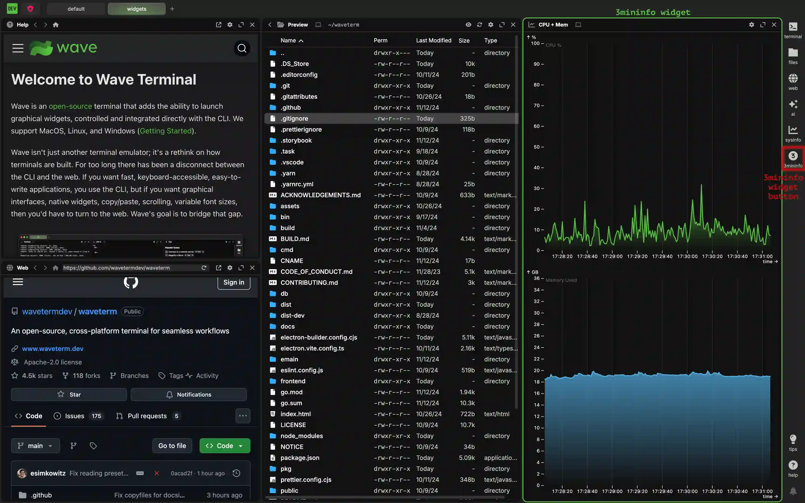

现在，假设你对默认的 100 个点（也就是 100 秒）没问题，但希望启动时显示所有 CPU 数据。这种情况下，可以这样写：

```json
{
    <... other widgets go here ...>,
    "all-cpu" : {
        "icon": "chart-scatter",
        "label": "all-cpu",
        "blockdef": {
            "meta": {
                "view": "sysinfo",
                "sysinfo:type": "All CPU"
            }
        }
    },
    <... other widgets go here ...>
}
```

这会向 widget 栏添加一个图标，点击后会默认启动 All CPU 图表。

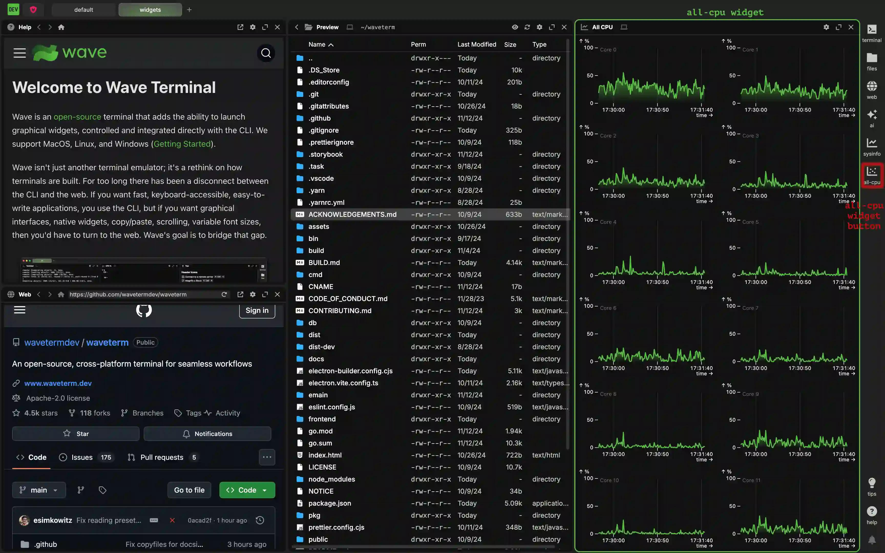

## 覆盖默认 Widget {#overriding-default-widgets}

Wave 在 widget 栏中自带默认 widget（terminal、agent、files、sessions、Common Text、web、sysinfo 和 processes）。你可以在 `widgets.json` 中覆盖它们的配置来修改或移除它们。默认 widget 的名称按顺序如下：

- `defwidget@terminal`
- `defwidget@agent`
- `defwidget@files`
- `defwidget@sessions`
- `defwidget@commontext`
- `defwidget@web`
- `defwidget@sysinfo`
- `defwidget@processviewer`

要移除其中任意一个，只需在 `widgets.json` 文件中将对应 key 设置为 `null`。

如果想查看它们的定义、复制粘贴它们，或了解它们如何工作，可以在 [GitHub - default widgets.json](https://github.com/wavetermdev/waveterm/blob/main/pkg/wconfig/defaultconfig/widgets.json) 查看全部定义。
