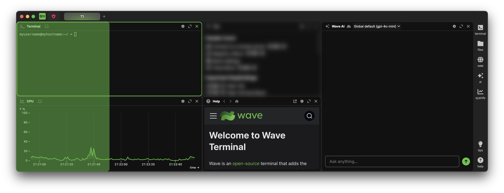
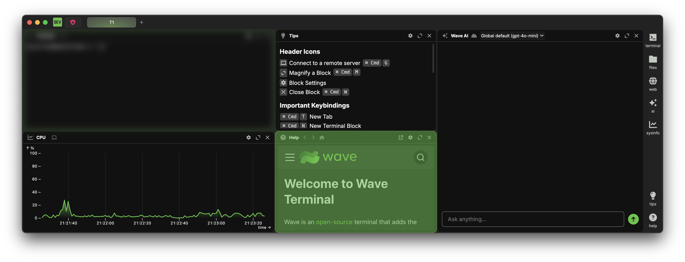
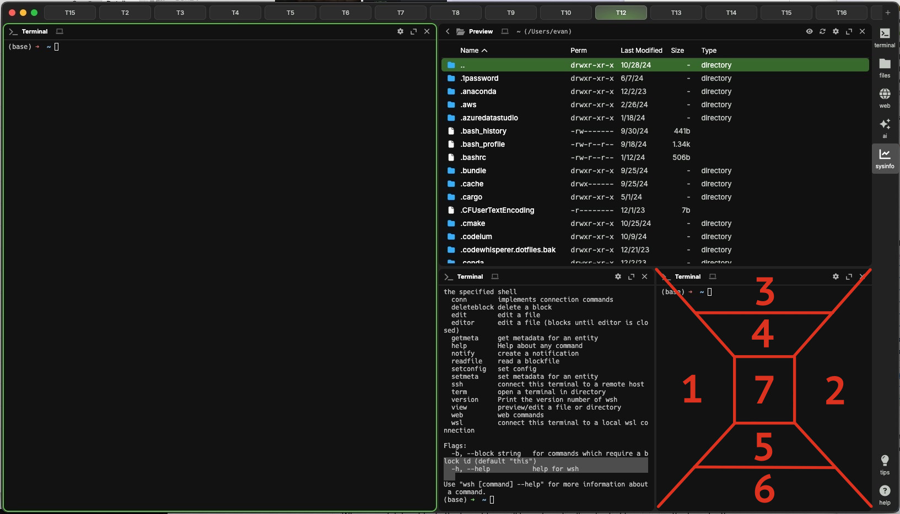

import { PlatformProvider, PlatformSelectorButton } from "@site/src/components/platformcontext";
import { Kbd } from "@site/src/components/kbd";

<PlatformProvider>

标签页是一组可以排列成平铺仪表板的 [Widget](./widgets)。你可以在某个工作区中创建任意数量的标签页，用来组织自己的工作流。

## 标签栏 {#tab-bar}

标签栏位于窗口顶部，会显示当前工作区中的所有标签页。点击标签页即可切换过去。切换标签页时，上一个标签页中的命令会继续运行，未保存的工作也会保留到你返回该标签页为止。如果关闭窗口，或在同一个窗口中切换工作区，这些工作会丢失。

<PlatformSelectorButton />

### 创建新标签页 {#creating-a-new-tab}

可以点击标签栏中标签页右侧的 <i className="fa-sharp fa-plus" title="plus"/> 按钮创建新标签页，也可以按键盘上的 <Kbd k="Cmd:t"/>。创建后焦点也会切换到新标签页。

### 关闭标签页 {#closing-a-tab}

将鼠标悬停在标签页上并点击出现的 <i className="fa-sharp fa-xmark-large" title="x"/> 按钮即可关闭标签页，也可以按键盘上的 <Kbd k="Cmd:Shift:w"/>。

关闭 block 是破坏性操作，会停止其中正在运行的进程并丢弃所有未保存工作。该操作无法撤销。

### 重新排列标签页 {#rearranging-tabs}

可以在标签栏中拖动标签页来重新排列它们。

### 切换标签页 {#switching-tabs}

点击标签栏中的已有标签页即可切换到它。也可以使用以下快捷键：

| 按键               | 功能                 |
| ------------------ | -------------------- |
| <Kbd k="Cmd:1-9"/> | 切换到指定编号的标签页 |
| <Kbd k="Cmd:["/>   | 向左切换标签页       |
| <Kbd k="Cmd:]"/>   | 向右切换标签页       |

### 固定标签页 {#pinning-a-tab}

固定标签页可以降低误关的概率。右键点击标签页并在出现的上下文菜单中选择 "Pin Tab" 即可固定。也可以将标签页拖到已有固定标签页之前来固定它。标签页固定后，它的 <i className="fa-sharp fa-xmark-large" title="x"/> 按钮会替换为 <i className="fa-solid fa-sharp fa-thumbtack" title="pin"/> 按钮。点击该按钮可取消固定。也可以将固定标签页拖到未固定标签页之后来取消固定。

## 标签页布局系统 {#tab-layout-system}

标签页由平铺的 block 组成。每个 block 的内容都是一个 widget。你可以移动 block，并将它们排列成最适合自己工作流的布局。也可以放大 block，专注查看某个特定 widget。

### 布局系统内部机制 {#layout-system-under-the-hood}

:::info

**定义**

- 布局树：标签页布局在内存中的表示，由节点组成
- 节点：布局树中的一个条目，可以是单个 block（叶子），也可以是有序节点列表。节点定义平铺方向（行或列）和无单位大小
- Block：布局树叶子中的内容，定义在指定布局位置显示什么内容

:::

我们的布局系统模拟 [CSS Flexbox](https://developer.mozilla.org/en-US/docs/Web/CSS/CSS_flexible_box_layout/Basic_concepts_of_flexbox) 系统，由列和行组成一棵树。在内部，布局表示为一棵 n 叉树，树中的每个节点要么是单个 block，要么是节点列表。树的每一层会交替平铺方向（第 1 层按行平铺，第 2 层按列平铺，第 3 层按行平铺，以此类推）。

### 布局操作 {#layout-actions}

<PlatformSelectorButton />

#### 添加新 block {#add-a-new-block}

可以从右侧边栏选择 widget 来添加新 block。

从布局树最顶层开始，由于第一层按行平铺，新 block 会添加到已有 block 的右侧。当横向已有 5 个 block 后，新 block 会开始添加到已有 block 下方，从右侧开始向左排列。当一个新 block 添加到某个已有 block 下方时，包含该已有 block 的节点会从单 block 节点转换为列表节点，并将原 block 定义移动到树中更深一层，作为节点列表的第一个元素。新 block 总是添加到最深层级中最后一个可用节点；“可用”定义为子节点少于 5 个。我们没有限制标签页中的 block 总数，但超过约 25 个 block 后可能会感到性能下降。

虽然自动放置新 block 时，我们为树中的每个节点定义了 5 个子节点限制，但节点实际可容纳的子节点数量没有硬性限制。block 放置后，你可以自由将它移动到布局中的任意位置。

#### 删除 block {#delete-a-block}

可以点击 block 右上角的 <i className="fa-sharp fa-xmark-large" title="x"/> 按钮删除 block，也可以右键点击 block 标题栏并在上下文菜单中选择 "Close Block"，或运行 [`wsh deleteblock` 命令](./wsh-reference#deleteblock)。另外，按 <Kbd k="Cmd:w"/> 可以关闭当前聚焦的 block/widget。关闭最后一个 block 后会留下一个空标签页。

删除 block 后，布局树会自动调整，以尽量减少树深度。

#### 移动 block {#move-a-block}

点击 block 标题栏并在标签页中拖动，即可移动 block。拖动时会出现占位提示，显示松手后 block 将落到哪里。

对于任意 block，都有 7 种不同的投放目标。block 会沿对角线划分为多个区域。如果目标 block 当前按行平铺（从左到右），将 block 投放到左侧或右侧区域，会把被拖动 block 放到与目标 block 相同的层级。这可以理解为行内投放。如果将 block 投放到非行内区域（对应相反平铺方向的区域），它会被放到目标 block 的上一层或下一层。朝外侧投放会把它放到目标 block 父节点的同一层级；朝 block 中心投放会创建一个新层级，并同时移动目标 block 和被投放 block。block 中间五分之一区域保留给交换操作。投放到这里会让目标 block 和被投放 block 在布局中交换位置。

<video width="100%" height="100%" playsinline autoplay muted controls>
  <source src="./img/drag-move-24fps-crf43.mp4" type="video/mp4" />
</video>

##### 可能的 block 移动方式 {#possible-block-movements}

:::note
除 Swap 外，所有 block 移动都会导致布局中的其他部分移动，以适应 block 的新位置。
:::

1. Inline before：将 block 投放到与目标 block 相同的节点下，并在相同平铺方向上放到目标之前
2. Inline after：将 block 投放到与目标 block 相同的节点下，并在相同平铺方向上放到目标之后
3. Out-of-line before outer：在相反平铺方向上，将 block 投放到目标 block 父节点之前
4. Out-of-line before inner：切分目标 block，在树中创建新节点，并在相反平铺方向上将被投放 block 放到目标 block 之前
5. Out-of-line after inner：切分目标 block，在树中创建新节点，并在相反平铺方向上将被投放 block 放到目标 block 之后
6. Out-of-line after outer：在相反平铺方向上，将 block 投放到目标 block 父节点之后
7. Swap：在布局中交换被投放 block 和目标 block 的位置，同时保留布局的其他部分

#### 调整 block 大小 {#resize-a-block}

<video width="100%" height="100%" playsinline autoplay muted controls>
  <source src="./img/resize-24fps-crf43.mp4" type="video/mp4" />
</video>

你并不是直接调整 block 的大小，而是调整包含这些 block 的节点。将鼠标悬停在 block 边距上时，光标会变为 <i className="fa-sharp fa-arrows-left-right" title="left/right arrows"/> 或 <i className="fa-sharp fa-arrows-up-down" title="up/down arrows"/>，表示该节点可调整大小的方向。500ms 后还会出现一条线，显示拖动该边距会影响多少个 block。点击并拖动该边距即可调整对应 block 的大小。

节点大小是无单位数值。同一树层级中所有节点大小的比例决定每个节点占据的空间。如果你移动某个 block 并导致其节点被删除，该层级中的其他节点会调整大小以适应新的比例。

### 放大 block {#magnify-a-block}

点击 <i className="custom-icon-inline custom-icon-magnify-disabled" title="magnify"/> 按钮，或按键盘上的 <Kbd k="Cmd:m"/>，可以放大 block。再次点击 <i className="custom-icon-inline custom-icon-magnify-enabled" title="un-magnify"/> 按钮，或再次按 <Kbd k="Cmd:m"/>，可以取消放大。

### 修改 block 之间的间距 {#change-the-gap-size-between-blocks}

block 之间的间距默认为 3px，但可以通过修改 `window:tilegapsize` 配置值来调整。关于如何修改配置值，请参阅[配置](./config)。

</PlatformProvider>
